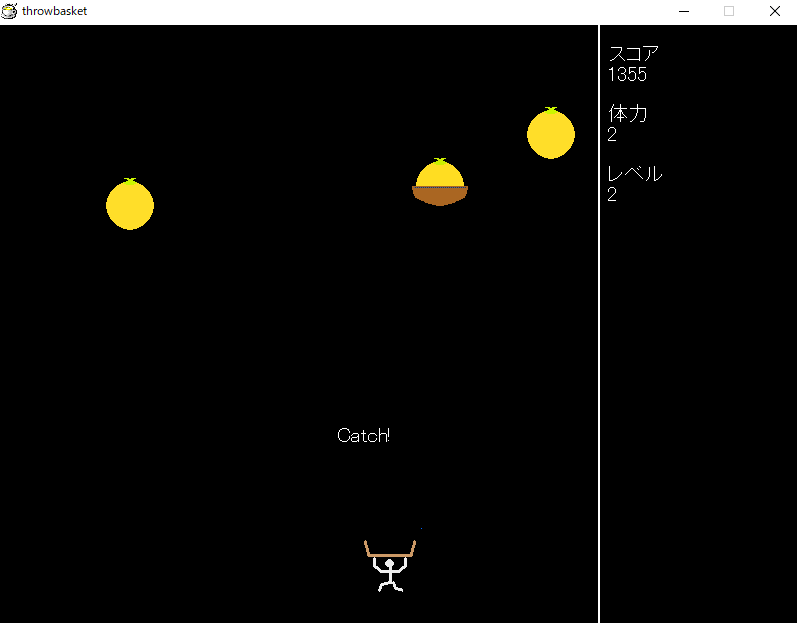
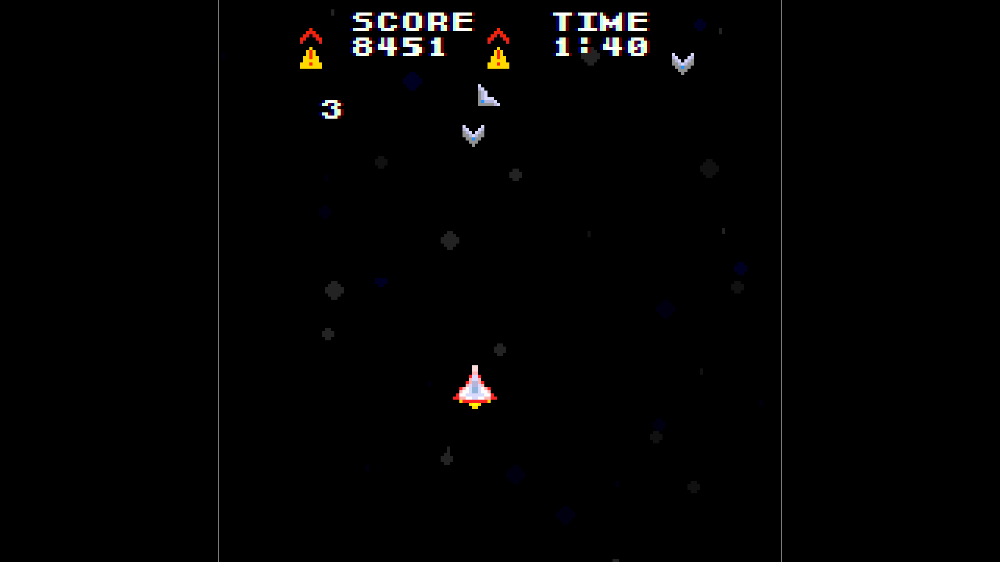

# ゲーム制作 ポートフォリオ
* nasTTY が現在までに作ったゲーム作品について列挙しています
  * なお、過去作品に関しては名義が違うものがあります

## 2017年以前
* 2009年(小学3年生のとき) に、自由帳にアクションゲームステージを描き、指でキャラクターを表現して、クラスメートにゲームを提供する「自由帳ゲーム」というシステムを開発し、人気を得ることができた
  - 「スタミナ消費でワンプレイ」「操作性は一貫しているが、性質の異なる複数のステージ」「コインまたは実績によるステージのアンロック」「週間ランキング」などのシステムを搭載していた
  - 当初、ほとんどゲームというものをしたことがなかった
    - 父の携帯で一度だけプレイしたFlashゲームが着想となっている。ゲーム性はほとんど模倣
* 2010年(小学4年生のとき) にプログラミングを学び始め、ゲーム作成を開始した。
  - 中学・高校のときはそれほどゲーム制作に熱心ではなく、主にゲーム以外のモノを作ったりしていた
    - 当時取り組んだ作品: OSもどきなど
* 言語は Hot Soup Processorをメインに使用していた。
  - 極稀にScratchを使用してゲームを作ることもあった
* 2Dシューティング・アクションを好んで作っていた

## Pastel
* 作成時期: 2018年夏
* ジャンル: 2D固定画面アクション
* 使用言語: Hot Soup Processor
* 使用グラフィックAPI: HSP標準命令(GDI)
* 概要: 画面上をクリックするとそこから水紋のような円が発生し、時間とともに、色相が変化しながら広がっていく。色様々な正方形が降ってくるので、円の周を、色が正方形と一致するときに正方形に触れさせられたら、得点となる。
* 工夫点: もともとは、高校のときに所属していた部活におけるゲーム展示で、電子黒板(プロジェクター+タッチペン)を活かすために制作した作品。
  「図形のみでゲームを表現する」という試みを初めて行った作品。またそのために、アンビエントのような効果音を自作して付けるという試みもした(効果音を内製したのは初めてだった)。
  1つの円で複数の正方形を消すと、消した数に応じて得点が指数関数的に増加するなど、ゲーム性も工夫した。
* 受賞: HSPプログラムコンテスト2018 (主催: ONION Software) 学生賞
  - (作品ページリンク)[https://dev.onionsoft.net/seed/info.ax?past=1682]

## Throw 4 Harvest
* 作成時期: 2021年冬～2022年春
* ジャンル: 2D固定画面アクション
* 使用言語: Hot Soup Processor
* 使用グラフィックAPI: Artlet2D(HSP用GDI+ライブラリ)
* 概要: 上から落ちてくるフルーツをキャッチするゲームだが、持っている籠を投げ上げてフルーツをその中に入れ、フルーツ入りの籠をキャッチするというゲーム。
  裸のフルーツを落としたら「体力」が1減り、0になるとゲームオーバーとなる。
  ゲームは「日付」単位で進み、1日が終わるとランダムな3種から1つアップグレードを選択して取得できる。また、1日2回、レベルアップしてフルーツの落ち方が激しくなっていく
* 工夫点: もともとは、2017年に原案を作成していたが、2021年秋、1から作り直した。
  この際、Pastelで使用した「図形のみでのゲーム表現」を更に一歩進め、人などのキャラクター、籠、フルーツなどもすべて四角形のみで描画することにした。
   アニメーションも工夫した。上部の樹はプレイヤーキャラクターの動きに応じて多重スクロール。裸のフルーツを落とすと、複数の小さい正方形になってバラバラに散らばる。プレイヤーキャラクターにはわずかに加速度が付いており、「いわゆる2DのPCゲームの操作感」にならないようにした。
   ゲーム性について、「籠を投げるキーを連打しながら左右に動く」が強過ぎたことから、短時間に連続で投げ上げたときに、移動速度・投げ上げ速度・投げ上げ精度が低下するように調整した(また、その際、プレイヤーキャラクターが汗をかき、予想投擲軌跡の表示が消えるようにした)。
   今作からはUIの綺麗さ・一貫性にも気を配った。Artlet2Dを使用したのは、回転正方形を綺麗に描画できたからである。また、アップグレードの選択は、「浮かんでいる3つのフルーツから1つを籠でキャッチして選択」というようにした。
   スプライトの描画処理・当たり判定を含め、ゲームエンジン部分はこのゲーム用に内製した。
* 受賞: サークル内コンテスト, 2021白鷺祭 (主催: コンピュータハウスランダム) 5位

## SC-Blaze Factory Test
* 作成時期: 2022年春
* ジャンル: 2D縦スクロールシューティング
* 使用言語: Hot Soup Processor
* 使用グラフィックAPI: HSP標準命令(GDI)
* 概要: 宇宙をテーマとした縦スクロールシューティングゲーム。スコアアタック、ワンプレイ制限時間つき、「1パターンの敵が画面外に出るか、全て倒すと次のパターンの敵が出てくる」という、キャラバンシューティング形式を採った。
* 工夫点: このゲームを作成した時期、私はシューティング全盛期の作品をいくつかプレイしており(例: 「R-TYPE(アーケード)」、「グラディウス(ファミコン)」「ツインビー(ファミコン)」) これらのシューティングに対して、「基本的に覚えゲーで、初見プレイが難しい」「弾がほとんど出ずかなり正確に狙わないと当てられない(ツインビーなど)、または弾がフルオートで出しっぱなしになり、当てに行くゲームというよりかは避けゲー(多くの弾幕シューティング)」という不満を抱いていた。
  文化祭のように1ゲーム1～2回しかプレイされない点も考慮して、最終的に「敵が出てくる前に、出てくる箇所をマーカーで示す」「弾は横2列のバースト射撃が基本で、弾を当てに行かなければならない」という方法によって解決することにした。
  ゲームデザインは8bit風とし、ドット絵はアニメーションも含めて、すべて自作した。
  ") 
  
  さらに、BGMもすべて、チップチューン楽曲を自作して使用した。効果音はGame Boy Drum Kitから作成してミックスした。
  ステージボスの行動パターンは3種類用意し、体力に応じて攻撃が激化するようにした。
  更に、開発後期にハードモードを追加した。制限時間はもともと2分であるが、ハードモード突入と同時に1分追加される(もともと3分であったが、展示1日目で、「死に戻り」を繰り返すには3分は長すぎると判断して、展示2日目で変更した)
* 受賞: なし

## Logically
* 作成時期: 2022年秋
* ジャンル: パズル
* 使用言語: Hot Soup Processor
* 使用グラフィックAPI: HSP標準命令(GDI)
* 概要: 論理回路をモチーフにした固定面パズルゲーム。
* 工夫点: パズルゲームを初めて作成してみた。信号伝達の計算には関数の再帰呼び出しによる深さ優先探索を採用した。

## Scramble Blaze

[リポジトリ](https://github.com/nasttymain/nassty3d)
[参考動画](https://x.com/ethllc4/status/1663917894420295685)

* 作成時期: 2023年春
* ジャンル: 3Dシューティング
* 使用言語: Hot Soup Processor
* 使用グラフィックAPI: HSP標準命令(GDI)
* 概要: 頂点計算・隠面消去を自力実装し、2D三角形描画命令のみで3D描画を行い作成したシューティングゲーム。

執筆中